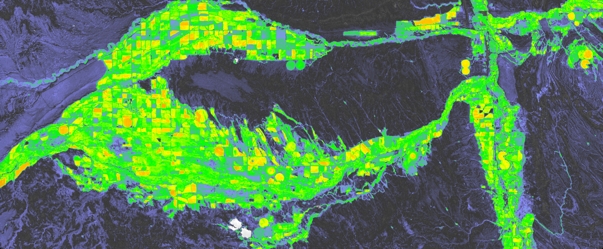
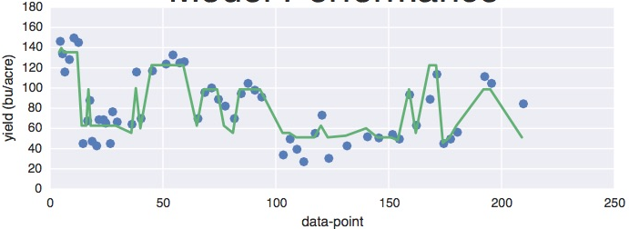

# Welcome to Barley Brain!

Barley Brain is a computer model to forecast regional barley yields in Colorado, Wyoming, Idaho and Montana.  The model extracts data from public web sites such as NASA(satellite images), the US Department of Agriculture (yield information), and Darksky.net (weather). Aggregating satellite images, county information, historic weather, and reported yield from 2010 to present.  

#### Technology used
*  Python
*  LANDSAT
*  Darksky.net API
*  Scikitlearn Adaboost, RandomForests, OLS
*  Matplotlib, Seaborn, Tableau, Plotly
*  Flask, Bootstrap

#### Data Collection 
WEATHER: 
Data for Barley Brain comes from a variety places.  Historic weather conditions were downloaded from the Darksky.net (http://www.Darksky.net) servers.  Darksky was chosen as it is free (up to 1000 calls per day), and can also handle the task of predicting weather well into the future.  
  
Weather data is downloaded in advance (data back to 2010 is in data/weather), the only processing of data was to drop unused columns during the download, in an effort to reduce file size. Additionally the daily weather data is convert to yearly averages so it can be used with the yield data.

YIELDS:  The USDA's(https://www.usda.gov/wps/portal/usda/usdahome) National Agricultural Statistics Service, has an online collection of historical crop yields.  This data is automatically collected by the model for cleaning and combining with the weather data.
Since Barley was the focus, only the barley data was downloaded.  Note that all state data gets downloaded so that in the future the model can be easily extended to any state or region.

 
#### Model and Performance
Three models were run on the data, Ordinary Least Squares, RandomForests, and Adaboost.
Primary selected model was Adaboost, as it provided the best RMSE (+/- 12.8 bushels/acre on the test set.)
Data is loaded from the combined file and split into train and test sets.  For training mode, the model discards all information not within the 2010 to 2014 date range. Similarly the test case drops years less than and including 2014, leaving only 2015 and 2016 data.

#### TEST RESULTS
The model initially way over-fit on the train data, and after reviewing in-stage Adaboost scoring, model was 'tuned' to remove over fitting as much as possible.  Resulting RMSE fit was 12.8 bushels/acre.  Not bad given the wide range of things farms can do to their fields in the course of a year.  The following chart shows model predicted yield (green line) and actual yield (blue dots).

#### Repo Organization:
* data   --> Storage for online data and file processing
* eda    --> Holds Jupyter Notebooks with EDA analysis
* images --> Images for Readme and from EDA analysis
* web_app -> Just like it says
* src    --> Holds the helper functions, code to extract 
                information from the web

