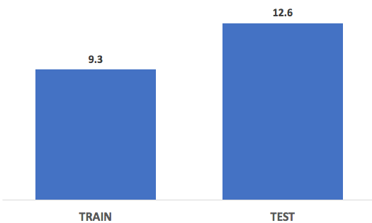

# Welcome to Barley Brain!

Barley Brain is a computer model to forecast regional barley yields in Colorado, Wyoming, Idaho and Montana.  The model extracts data from public web sites such as NASA, the US Deparment of Agriculture, Darksky.net (weather), aggregating satellite images, county information, historic weather, and reported yield from 2010 to present.

#### Technology used
*  Python
*  sklearn Adaboost, RandomForests, ElasticNet
*  LANDSAT
*  Darksky.net API

#### Data Collection 
WEATHER: 
Data for Barley Brain comes from a variety places.  Historic weather conditions were downloaded from the Darksky.net (http://www.Darksky.net) weather servers.  Darksky was chosen as it is free (up to 1000 calls per day), and can also handle the task of predicting weather into the future.  
  
Weather data is downloaded in advance (for ease, data back to 2010 is data/weather), the only processing of data is to drop unused columns during the download to reduce file size. Additionally the weather data is compressed into yearly averages so it can be used with the yield data.

YIELDS:  The USDA (https://www.usda.gov/wps/portal/usda/usdahome) has an online collection of historically reported crop yields.  This data is automatically collected by the model for cleaning combining with the weather data.
Since Barley was the focus, only the barley data was downloaded.  Note that all state data gets downloaded so that in the future the model can be easily extended to any state or region.
Yield data is downloaded when the model runs and junk columns are dropped.
 
#### Model & Performance
Three models were run on the data, Ordinay Least Squares, RandomForests, and Adaboost.
Primary selected model was Adaboost, as it provided a the best RMSE (+/- 12 bussels/acre on the test set.)
Data is loaded from the combined file and split into train and test sets.  For training mode, the model discards all information not within the 2010 to 2014 timeframe. Similary the test case drops years less than and including 2014, leaving must 2015 and 2016 data.

TRAIN-TEST SPLIT RESULTS:

#### Repo Organization:
* data   --> Storage for online data and file processing
* eda    --> Holds jupyter notebooks with EDA analysis
* images --> Images for readme and from eda analysis
* web_app -> Just like it says
* src    --> Holds the helper functions, code to extract 
                information from the web

